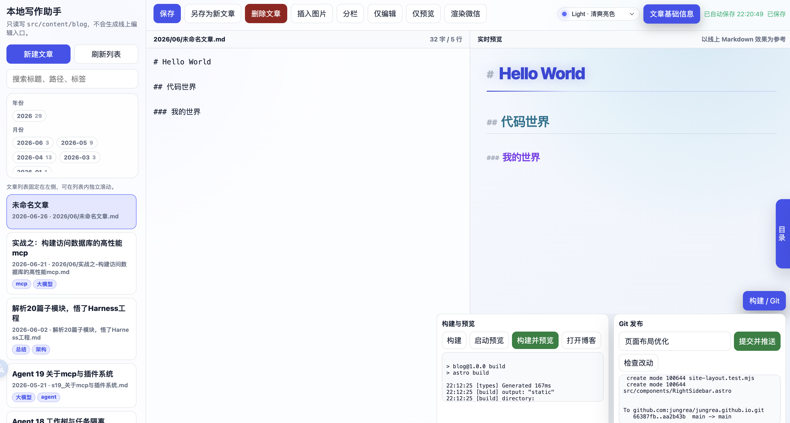

# My Blog

基于 [Astro](https://astro.build) 构建的个人技术博客，部署于 GitHub Pages。
站点采用三栏式布局：左侧为个人信息与导航，中间为正文，右侧为最近更新、热门标签和文章目录。

## 技术栈

- **框架**：Astro 4
- **样式**：原生 CSS，支持深色/浅色主题切换
- **内容**：Markdown，通过 Astro Content Collections 管理
- **代码高亮**：Shiki（one-dark-pro / one-light）
- **部署**：GitHub Actions → GitHub Pages

## 项目结构

```
src/
├── components/   # UI 组件（Header、Footer、PostCard、RightSidebar 等）
├── content/blog/ # Markdown 文章
├── layouts/      # 页面布局（BaseLayout、BlogPostLayout）
├── pages/        # 路由页面（首页、文章列表、标签、关于）
├── plugins/      # Remark 自定义插件
├── styles/       # 全局样式
└── utils/        # 工具函数
local-editor/     # 本地网页写作助手（独立服务，不参与线上构建）
public/           # 静态资源（图片、favicon 等）
```

## 本地开发

```bash
npm install
npm run dev      # 启动开发服务器（热更新，边改边看）
npm run build    # 构建生产版本
npm run preview  # 预览构建结果（模拟生产环境）
```

> 推送前建议先执行 `npm run build && npm run preview` 预览，确认无误后再推送。

## 本地写作助手

如果不想直接编辑 `.md` 文件，可以启动本地网页写作助手：

```bash
npm run write
```

然后访问 `http://127.0.0.1:4310`。

写作助手只在本地运行，不会生成线上页面。它支持：

- 网页式 Markdown 编辑、实时预览、自动保存、分栏联动滚动、预览目录与微信公众号渲染
- 支持 Light、GitHub Dark、Dracula 三套写作/预览主题
- 支持上传图片、选择已有图片，并在光标处插入 Markdown 图片引用
- 读取、搜索、按年份/月筛选、保存、删除 `src/content/blog/` 下的文章
- 新文章自动按 `YYYY/MM/slug.md` 保存，方便按年月管理
- 粘贴图片并保存到 `public/images/YYYY/MM/`
- 一键构建、本地预览、查看 Git 改动、提交并推送



## 写作

在 `src/content/blog/` 下新建 `.md` 文件，头部使用 frontmatter 定义元数据：

```yaml
---
title: 文章标题
description: 文章简介
pubDate: 2026-01-01
tags: [标签1, 标签2]
---
```

推送到 `main` 分支后，GitHub Actions 自动构建并部署。
