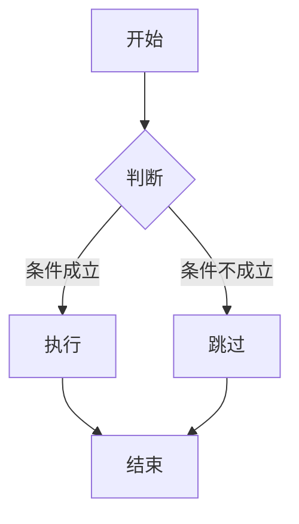
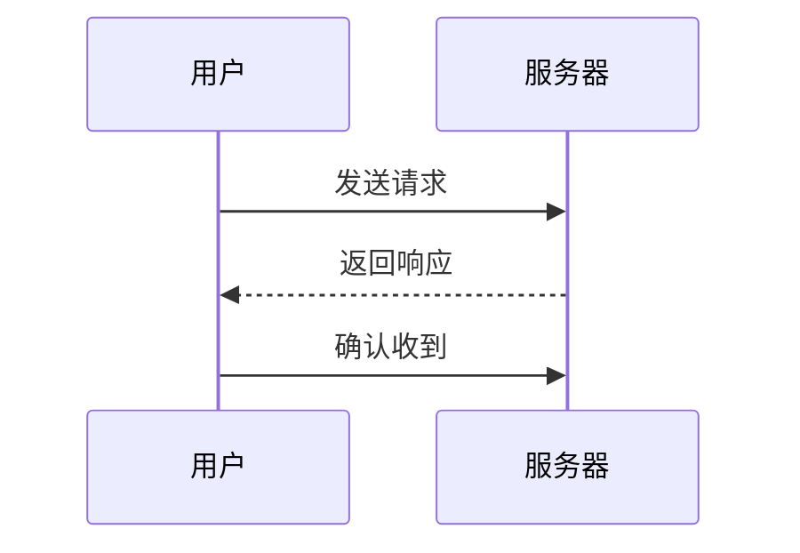
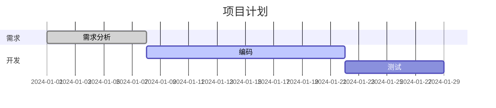

# Markdown 语法大全


> Markdown 是一种轻量级标记语言，由 John Gruber 于 2004 年创建。它允许人们使用易读易写的纯文本格式编写文档，然后转换成有效的 HTML。本文档系统整理了 Markdown 的常用及扩展语法。

---

## 目录

1. [标题](#1-标题)
2. [段落与换行](#2-段落与换行)
3. [字体样式](#3-字体样式)
4. [引用](#4-引用)
5. [列表](#5-列表)
6. [代码](#6-代码)
7. [分割线](#7-分割线)
8. [链接](#8-链接)
9. [图片](#9-图片)
10. [表格](#10-表格)
11. [任务列表](#11-任务列表)
12. [脚注](#12-脚注)
13. [HTML 内嵌](#13-html-内嵌)
14. [转义字符](#14-转义字符)
15. [扩展语法（GFM）](#15-扩展语法gfm)
16. [Emoji 表情](#16-emoji-表情)
17. [数学公式（LaTeX）](#17-数学公式latex)
18. [图表 / Mermaid](#18-图表--mermaid)

---

## 1. 标题

使用 `#` 号标记标题，`#` 的数量表示标题层级，支持 1~6 级标题。

```markdown
# 一级标题
## 二级标题
### 三级标题
#### 四级标题
##### 五级标题
###### 六级标题
```

### 效果

> # 一级标题
> ## 二级标题
> ### 三级标题
> #### 四级标题
> ##### 五级标题
> ###### 六级标题

### 另类写法（仅支持 H1、H2）

```markdown
一级标题
========

二级标题
--------
```

---

## 2. 段落与换行

### 段落

段落由一个或多个连续的文本行组成，段落之间用**空行**分隔。

```markdown
这是第一段落。
这是第一段落的继续。

这是第二段落。
```

### 换行

在行尾添加 **两个或多个空格** 再按回车，即可实现软换行。

```markdown
第一行··
第二行
```

> 注：`·` 表示空格。大多数编辑器也支持直接使用 `<br>` 标签换行。

---

## 3. 字体样式

| 样式 | 语法 | 示例效果 |
|------|------|----------|
| **加粗** | `**文本**` 或 `__文本__` | **加粗** |
| *斜体* | `*文本*` 或 `_文本_` | *斜体* |
| ~~删除线~~ | `~~文本~~` | ~~删除线~~ |
| ==高亮== | `==文本==`（部分编辑器支持） | ==高亮== |
| ***加粗斜体*** | `***文本***` | ***加粗斜体*** |
| <u>下划线</u> | `<u>文本</u>`（HTML 语法） | <u>下划线</u> |
| H~2~O | `H~2~O`（下标，部分支持） | H~2~O |
| X^2^ | `X^2^`（上标，部分支持） | X^2^ |

### 示例

```markdown
**这是加粗文字**
*这是斜体文字*
***这是加粗且斜体的文字***
~~这是删除线文字~~
==这是高亮文字==
H~2~O 是水的化学式
X^2^ + Y^2^ = Z^2^
```

---

## 4. 引用

使用 `>` 符号表示引用，可以嵌套。

```markdown
> 这是一段引用。
> 这是同一引用的第二行。

> 嵌套引用
>
> > 第二层引用
> >
> > > 第三层引用

> 引用内可以包含其他 Markdown 元素
>
> - 列表项一
> - 列表项二
>
> **加粗文字** 和 `代码`
```

### 效果

> 这是一段引用。
> 这是同一引用的第二行。
>
> > 嵌套引用
> >
> > > 第三层引用

---

## 5. 列表

### 无序列表

使用 `-`、`*` 或 `+`。

```markdown
- 苹果
- 香蕉
- 樱桃

* 红色
* 绿色
* 蓝色

+ 第一项
+ 第二项
+ 第三项
```

### 有序列表

使用数字加点号。

```markdown
1. 第一步
2. 第二步
3. 第三步
```

> 注意：数字不必连续，Markdown 会自动按顺序排列。
>
> ```markdown
> 1. 第一项
> 1. 第二项
> 1. 第三项
> ```
>
> 效果等同于：
>
> 1. 第一项
> 2. 第二项
> 3. 第三项

### 嵌套列表

在子列表前缩进 **2 或 4 个空格**（或一个 Tab）。

```markdown
- 水果
  - 热带水果
    - 芒果
    - 菠萝
  - 温带水果
    - 苹果
    - 梨
- 蔬菜
  1. 叶菜类
  2. 根茎类
```

### 效果

- 水果
  - 热带水果
    - 芒果
    - 菠萝
  - 温带水果
    - 苹果
    - 梨
- 蔬菜
  1. 叶菜类
  2. 根茎类

---

## 6. 代码

### 行内代码

使用反引号 `` ` `` 包裹。

```markdown
请使用 `print("Hello World")` 输出内容。
```

### 代码块

使用三个反引号 ` ``` ` 包裹，可以指定语言实现语法高亮。

````markdown
```python
def hello():
    print("Hello, Markdown!")
```
````

```python
def hello():
    print("Hello, Markdown!")
```

### 缩进代码块

每行缩进 4 个空格或 1 个 Tab。

```
    这是一段缩进代码。
    它不会语法高亮。
```

---

## 7. 分割线

使用三个或以上的 `-`、`*` 或 `_`。

```markdown
---

***

___
```

### 效果

---

***

___

---

## 8. 链接

### 行内链接

```markdown
[显示文本](https://example.com)
[显示文本](https://example.com "鼠标悬停提示")
```

### 参考式链接

```markdown
[Google][google]
[GitHub][github]

[google]: https://www.google.com
[github]: https://github.com
```

### 自动链接

```markdown
<https://example.com>
<user@example.com>
```

### 快速链接

某些编辑器会自动识别 URL。

```markdown
https://example.com
```

### 锚点链接

链接到本文档的其他位置。

```markdown
[跳转到标题章节](#1-标题)
```

---

## 9. 图片

语法与链接类似，前面加 `!`。

```markdown


```

### 带链接的图片

```markdown
[](跳转链接)
```

### 示例

```markdown

```

---

## 10. 表格

使用 `|` 分隔列，`-` 分隔表头与内容。

```markdown
| 左对齐 | 居中对齐 | 右对齐 |
| :----- | :------: | -----: |
| 单元格 | 单元格   | 单元格 |
| 单元格 | 单元格   | 单元格 |
```

### 效果

| 左对齐 | 居中对齐 | 右对齐 |
| :----- | :------: | -----: |
| 单元格 | 单元格   | 单元格 |
| 单元格 | 单元格   | 单元格 |

> 对齐方式：
> - `:---` 左对齐
> - `:---:` 居中对齐
> - `---:` 右对齐

### 表格内换行

使用 `<br>` 标签。

```markdown
| 项目 | 说明 |
|------|------|
| Markdown | 轻量级<br>标记语言 |
| HTML | 超文本<br>标记语言 |
```

---

## 11. 任务列表

使用 `- [ ]` 表示未完成，`- [x]` 表示已完成。

```markdown
- [x] 已完成任务
- [ ] 未完成任务
- [ ] 待办事项一
  - [ ] 子任务一
  - [ ] 子任务二
```

### 效果

- [x] 已完成任务
- [ ] 未完成任务
- [ ] 待办事项一
  - [ ] 子任务一
  - [ ] 子任务二

---

## 12. 脚注

```markdown
这是一个带有脚注的句子[^1]。

[^1]: 这是脚注的内容。
```

部分编辑器支持行内脚注：

```markdown
这是一个带有脚注的句子[^2]。

[^2]: 脚注可以包含多段内容，可以包含 `代码` 等。
```

---

## 13. HTML 内嵌

Markdown 支持直接嵌入 HTML 标签。

```markdown
<p>这是 HTML 段落</p>

<div style="color: red; padding: 10px; border: 1px solid #ccc;">
  这是一个带样式的 div 区块。
</div>

<details>
  <summary>点击展开</summary>
  这里是隐藏的详细内容。
</details>

<kbd>Ctrl</kbd> + <kbd>C</kbd>
```

### 效果

<details>
  <summary>点击展开</summary>
  这里是隐藏的详细内容。
</details>

<kbd>Ctrl</kbd> + <kbd>C</kbd>

---

## 14. 转义字符

在 Markdown 特殊符号前加反斜杠 `\` 即可转义。

```markdown
\* 这不是斜体 \*
\# 这不是标题
\- 这不是列表
\` 这不是代码
```

| 符号 | 名称 | 转义写法 |
|------|------|----------|
| \\ | 反斜杠 | `\\\\` |
| \` | 反引号 | `\\\`\` |
| \* | 星号 | `\\*` |
| \_ | 下划线 | `\\_` |
| \{\} | 大括号 | `\\{\\}` |
| \[\] | 方括号 | `\\[\\]` |
| \(\) | 圆括号 | `\\(\\)` |
| \# | 井号 | `\\#` |
| \+ | 加号 | `\\+` |
| \- | 减号 | `\\-` |
| \. | 句号 | `\\.` |
| \! | 感叹号 | `\\!` |
| \| | 竖线 | `\\|` |

---

## 15. 扩展语法（GFM）

> GFM = GitHub Flavored Markdown，GitHub 风格的 Markdown。

### 自动链接（URL、邮箱）

```
www.example.com  → 自动转换为链接
user@example.com → 自动转换为邮箱链接
```

### 删除线（已在前文介绍）

```
~~删除线~~
```

### 表情符号简码

```
:smile: :+1: :rocket:
```

### 表格（已在前文介绍）

### 任务列表（已在前文介绍）

### 代码块 + 语言标识（已在前文介绍）

---

## 16. Emoji 表情

使用 `:emoji_name:` 语法。

```markdown
:smile: :heart: :+1: :rocket: :fire: :100: :clap: :tada:
:warning: :x: :o: :question: :exclamation: :memo:
:book: :computer: :phone: :email: :calendar:
:sunny: :moon: :star: :cloud: :rainbow:
:dog: :cat: :fish: :bird: :bee:
:apple: :banana: :grapes: :watermelon: :pizza:
```

### 效果

😄 ❤️ 👍 🚀 🔥 💯 👏 🎉

⚠️ ❌ ⭕ ❓ ❗ 📝

📖 💻 📧 📅

☀️ 🌙 ⭐ ☁️ 🌈

🐶 🐱 🐟 🐦 🐝

🍎 🍌 🍇 🍕

> 常用 Emoji 简码查询：[https://www.emojicopy.com](https://www.emojicopy.com)

---

## 17. 数学公式（LaTeX）

> 需要编辑器支持（如 Typora、Jupyter、Obsidian 等），使用 `$` 包裹。

### 行内公式

```markdown
质能方程：$E = mc^2$

勾股定理：$a^2 + b^2 = c^2$
```

### 公式块

```markdown
$$
\int_{a}^{b} f(x) \, dx = F(b) - F(a)
$$
```

$$
\int_{a}^{b} f(x) \, dx = F(b) - F(a)
$$

### 更多示例

```markdown
$$
\sum_{i=1}^{n} i = \frac{n(n+1)}{2}
$$

$$
\lim_{x \to \infty} \frac{1}{x} = 0
$$

$$
\begin{pmatrix}
1 & 0 & 0 \\
0 & 1 & 0 \\
0 & 0 & 1
\end{pmatrix}
$$

$$
f(x) =
\begin{cases}
x^2, & x \geq 0 \\
-x, & x < 0
\end{cases}
$$
```

---

## 18. 图表 / Mermaid

> 需要编辑器支持 Mermaid（如 GitHub、Obsidian、Typora 等）。

### 流程图

````markdown

````


### 时序图

````markdown

````

### 甘特图

````markdown

````

---

## 附录

### 常见 Markdown 编辑器

| 编辑器 | 平台 | 特点 |
|--------|------|------|
| Typora | Windows / macOS / Linux | 所见即所得，沉浸式写作 |
| VS Code | 全平台 | 强大插件生态（Markdown Preview Enhanced） |
| Obsidian | 全平台 | 知识库管理，双向链接 |
| Markdown Here | 浏览器扩展 | 邮件撰写 |
| StackEdit | Web | 在线编辑，云同步 |
| Notion | 全平台 | 全能笔记，数据库 |
| GitHub | Web | Issue / PR / Wiki / README |
| Jupyter Notebook | Web / 本地 | 数据科学，交互式文档 |

### 本语法大全适用规范

- **基础语法**：遵循 John Gruber 原版 Markdown
- **扩展语法**：兼容 GitHub Flavored Markdown (GFM)
- **特殊扩展**：Typora、Obsidian 等常见编辑器支持的特性

---

> **参考资料**
>
> - [Markdown 官方文档](https://daringfireball.net/projects/markdown/)
> - [GitHub Flavored Markdown Spec](https://github.github.com/gfm/)
> - [CommonMark](https://commonmark.org/)

---

*最后更新：2026-05-01*
